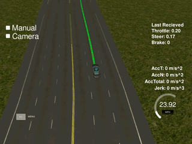
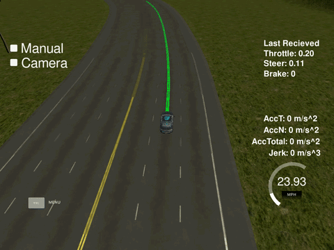

# Self driving Car - Nanodegree Final

Capstone Project of Udacity's Self-Driving Car Engineer Nanodegree Program

## Introducing

The goal of the project is to capsulate the whole gained knowledge of the "Self driving car"-Nanodegree course and use it to control a real-driving-car on a test-track in California.
The project uses the [Roboter-Operating-System](https://en.wikipedia.org/wiki/Robot_Operating_System) (short: ROS) which is a framework mostly used in the fields of robotics and autonomous systems.


## Team
The project was proudly developed by the following contributors (in alphabetical order).

| *Name*: | Adam Gyarmati | Gaurav Asati | Kevin Hubert | Lukas Leonard Köning |
|:---:|:---:|:---:|:---:|:---:|
|*ROS expercience*|Done ROS tutorials|Done ROS tutorials|Done ROS tutorials|Done ROS tutorials|
|*Team role*|Developer|Developer|Developer & Teamlead|Developer|
|*Time zone*|GMT-8|GMT+5|GMT+1|GMT+1|
|*GitHub profile image*| [](https://github.com/gyadam)    | [](https://github.com/gasatig) | [](https://github.com/KevinHubert-Dev)  | [](https://github.com/LukasLeonardKoening)  |

** Click on the picture of the respective person to view their GitHub profile.

---

## Setup

We recommend to use the Docker container provided by Udacity. To do so first build the docker container and then run the docker file:

```sh
# Ensure you are in the directory including the provided Dockerfile
# Build
docker build . -t capstone

# Run
docker run -p 4567:4567 -v $PWD:/capstone -v /tmp/log:/root/.ros/ --rm -it capstone
```

To run the server-program on your local enviroment:

``` sh
# Clone this repository

git clone <Repository>
cd <Repository-Folder>

# Install requirements
pip install -r requirements.txt

# Build project and source ros-enviroment-variables
cd ros
catkin_make
source ./devel/setup.bash

# Launch
roslaunch ./launch/styx.launch
```

To see the result you need to download the [simulator](https://github.com/udacity/CarND-Capstone/releases) (we have tested it using version 1.3) and run it. Ensure that port 4567 is free to used.

---

## Referencens and additional reading material

The following references/links/papers gave us inspiration and helped us to solve the project.
- [Short description 1](https://udacity.com)
- [Short description 2](https://udacity.com)
- [Short description 3](https://udacity.com)

More about the Self-Driving Car Engineer Nanodegree Program at Udacity can be found here:
[Become a Self-Driving Car Engineer](https://www.udacity.com/course/self-driving-car-engineer-nanodegree--nd013)

---

## Documentation

In this documentation the structure and the way how we achieved the goal (control the car) is briefly explained.

### Table of Contents

1. ROS System Architecture
2. Traffic Light Detection
3. Waypoint Updater
4. Drive-By-Wire

### 1.) ROS System Architecture


The image above shows the system architecture of our implementation. There are three main subsystems in an autonomous vehicle architecture: Perception, Planning, Control. The perception subsystem processes sensor information (like camera images, LiDAR point clouds or IMU data) to information that can be used by the planning subsystem. The planning subsystem takes in this information and decides what the car should do. It creates trajectorys for the control subsystem. The control subsystem takes in this information, uses different controllers to create throttle, break and steering commands and sends them to the components of the car. 

Our task was to implement the Traffic Light Detection Node, the Waypoint Updater Node and the DBW Node. These are explained in the next sections in more detail.

### 2.) Traffic Light Detection


Lorem ipsum dolor sit amet, consectetur adipiscing elit. Duis dictum sapien vel rutrum ultricies. Mauris eu elementum est. Vestibulum ante ipsum primis in faucibus orci luctus et ultrices posuere cubilia Curae; Nunc et tortor id eros efficitur suscipit. Sed vitae sem eros. Sed nec ligula euismod, bibendum odio eu, pretium.

### 3.) Waypoint Updater

The waypoint-upter is responsible for planning the path to drive from one wapoint to the next and so on.
Therefore the waypoint-updater uses the currently driven waypoint and uses splines or polynonminal-curve n-degree to fit the curvature between the given waypoints best.
The waypoint-updater is implemented in the following files:
[./ros/src/waypoint_updater/waypoint_updater.py](https://github.com/gyadam/self-driving-system-integration/blob/master/ros/src/waypoint_updater/waypoint_updater.py)
* The development was excluded into the separated feature-branches. Moreover we decided to have two developer for each feature, one for implementing and the other one for quality accurance by doing a code review.


| Branch | Implemented by | Code-reviewer |
|:---:|:---:|:---:|
|[waypoint_updater_partial](https://github.com/gyadam/self-driving-system-integration/tree/waypoint_updater_partial)|Adam Gyarmati|Kevin Hubert|
|[waypoints_updater_full](https://github.com/gyadam/self-driving-system-integration/tree/waypoints_updater_full)|Kevin Hubert|Adam Gyarmati|

The waypoint-updater subscribes to 4 ros-topics makes an aggregation of the given data and publishes to a single topic (see visualization below) which represetens the final-waypoints to drive for. 


| Subscribed or Published | Node-Name | Explaination |
|:----:|:----:|:----|
|Subscribe|base_waypoints|This topic is only publishedo once when the simulator starts and returns a list of waypoints (e.g.: GPS-waypoints) which represents waypoints to drive for|
|Subscribe|current_pose|This nodes is used to get information about the current position of the car (x-y-coordinates and heading-direction|
|Subscribe|traffic_waypoint|Get information about upcoming traffic lights and state of the traffic-light to plan deceleration|
|Publish|final_waypoints|The final waypoints contains, as the name says, the waypoint which should be driven and even informations about the speed based on the maximum allowed speed for the given waypoint and even a deceleration for upcoming traffic-lights (especially when they are red)|

Below you can find some code snippets used for the waypoint_updater. All snippets are part of the "waypoint_updater.py"-file

Plan next waypoints based on the planning-distance, maximum velocity and required acceleration due to traffic-lights
```python
# Get the range of waypoint of interest for the current planning
closest_idx = self.get_closest_waypoint_idx()
farthest_idx = closest_idx + LOOKAHEAD_WPS
base_waypoints = self.base_lane.waypoints[closest_idx:farthest_idx]

# If there is no stopsign or the given stopsign is out of the range of interest, just keep driving
if self.stopline_wp_idx == -1 or (self.stopline_wp_idx >= farthest_idx):
  lane.waypoints = base_waypoints
else: # If the stopsign is relevant for us (in our planning range), calculate when the decelerate
  lane.waypoints = self.decelerate_waypoints(base_waypoints, closest_idx)
```

Iterate through waypoints to apply deceleration-curve for a smooth stop infront of a traffic-light
> Note: For minimization of the code the comments were shorted/changed in the following snippet
```py
for i, wp in enumerate(waypoints):
  p = Waypoint() # ROS Waypoint instance
  p.pose = wp.pose # Copy original waypoint position

  # Get position where to stop. -2 is required cause by car-length
  stop_idx = max(self.stopline_wp_idx - closest_idx - 2, 0)
  # Use distance as coefficient for deceleration-curve
  dist = self.distance(waypoints, i, stop_idx)

  # Calculate velocity for specific waypoit
  vel = math.sqrt(2 * MAX_DECEL * dist)
  if vel < 1.:
    vel = 0.

  # Use the smaller value of the following two:
  #   - maximum-speed due to speed-limit
  #   - decelerating cause by detected red traffic light
  p.twist.twist.linear.x = min(vel, wp.twist.twist.linear.x) 
  temp.append(p)
  return temp
```

The waypoint-updater was implemented by Adam Gyarmati and Kevin Hubert.

### 4.) Drive-By-Wire


The DBW Node (Drive-By-Wire) is responsible for sending throttle, steering and brake commands to the car. Drive by wire is the use of electrical or electro-mechanical systems for performing vehicle functions traditionally achieved by mechanical systems, e.g. hitting the brake pedal. 

In this implementation the DBW Node subscribes to the `current_velocity` ROS topic (current velocity of the car), to the `twist_cmd` ROS topic (velocity commands from the Waypoint Follower Node) and to the `dbw_enabled` ROS topic (information about the DBW system status). The DBW Node publishes onto the `throttle_cmd`, `steering_cmd` and the `brake_cmd` ROS topics. 

The implementation is splitted up into two files: `ros/src/twist_controller/dbw_node.py` and `ros/src/twist_controller/twist_controller.py`. Inside the `dbw_node.py` file is the whole ROS logic implemented (Subscribers, Publisher) and also the loop, which runs at 50Hz the controller. It only publishes onto the topics, if drive by wire is enabled. There are cases, where drive by wire is disabled, e.g. when the car stands at a red traffic light. 

The controller is inside the `twist_controller.py` file. It uses a Lowpass Filter, a PID controller and a Yaw controller (`yaw_controller.py`) to achieve the throttle and steering commands. To reduce oscillation from the velocity command (from the `twist_cmd` topic) the Lowpass filter is used. Since the integrational error of the PID controller would increase, when the vehicle does not move, the PID controller has to be reseted every time the DBW is disabled.
The brake command is calculated seperatly as torque value:

```python
## Brake value calculation
# Since the car has an automatic transmission, a brake value is needed to keep the car in position
if linear_vel == 0. and current_vel < 0.1:
  throttle = 0
  brake = 700 #N*m - Torque
# If we want to decrease velocity, brake is used
elif throttle < .1 and delta_v < 0:
  throttle = 0
  decel = max(delta_v, self.decel_limit)
  brake = abs(decel)*self.vehicle_m*self.wheel_r #N*m - Torque
```

The torque for the brake motor is calculated by `deceleration * vehicle_mass * wheel_radius`.

**The "overshooting" problem**

During testing we encountered an "overshooting" problem in the steering (s. image left). This was caused by the Waypoint Follower node which only sends new angular velocity commands, if the vehicle drifts of the trajectory further then a specific threshold. We fixed this issue by removing the threshold and computing the angular velocity at every rate.

| "Overshooting" issue       | Fixed "Overshooting"             |
| -------------------------- | -------------------------------- |
|  |  |

The DBW Node was implemented by Lukas Leonard Köning.

---

# Traffic light detection and classification.

Images in simulator world are quite different from real world. One of main differences is traffic lights. In real world traffic lights are inside Yellow casings while in simulator in they are in Black casings. For real world data we need to extract images from shared ROS bag files while for simulator we need to capture images using "Manual" option in simulator. Use below steps to capture images from shared ROS bag files

1: Initiate "roscore" from one terminal.
2: Open another terminal and initiate "rosbag play -l path/to/your_rosbag_file.bag"
3: Open one more terminal and create a new folder where you want to have captured images.
4: Go to newly created folder and initiate "rosrun image_view image_saver _sec_per_frame:=0.01 image:=/image_raw" to capture ROS bag images.

Do note that ROS file will play in loop, so we need to stop once it had completed one  iteration.

Once this is done the real laborious task of labeling images to comes. In this we have to mark and classify traffic light images into Red(No GO)/Green(GO)/Yellow (take a call for go/ho go). There are various tools available for this. One the most common tool used in this is labelImg (add link). On labellings of images it generates a xml file which has class, left minimum and right maximum for each traffic light in given images.

After we have required xml files, we need to create TF records for these so that we fine tune object detection models using it. There are many open source scripts for that.

In this project we have have skipped the manual laborious work by re-using labeled data from other students. We used data from public github  repo [link](https://github.com/alex-lechner/Traffic-Light-Classification). Required data can be downloaded from shared [link](https://www.dropbox.com/s/vaniv8eqna89r20/alex-lechner-udacity-traffic-light-dataset.zip?dl=0).


---
## Result

**Impressiv result images and video here...**

**Discussion of the results...**

---

## License

Copyright (c) 2020 Adam Gyarmati, Gaurav A., Kevin Hubert, Lukas Leonard Köning

Permission is hereby granted, free of charge, to any person obtaining a copy
of this software and associated documentation files (the "Software"), to deal
in the Software without restriction, including without limitation the rights
to use, copy, modify, merge, publish, distribute, sublicense, and/or sell
copies of the Software, and to permit persons to whom the Software is
furnished to do so, subject to the following conditions:

The above copyright notice and this permission notice shall be included in all
copies or substantial portions of the Software.

THE SOFTWARE IS PROVIDED "AS IS", WITHOUT WARRANTY OF ANY KIND, EXPRESS OR
IMPLIED, INCLUDING BUT NOT LIMITED TO THE WARRANTIES OF MERCHANTABILITY,
FITNESS FOR A PARTICULAR PURPOSE AND NONINFRINGEMENT. IN NO EVENT SHALL THE
AUTHORS OR COPYRIGHT HOLDERS BE LIABLE FOR ANY CLAIM, DAMAGES OR OTHER
LIABILITY, WHETHER IN AN ACTION OF CONTRACT, TORT OR OTHERWISE, ARISING FROM,
OUT OF OR IN CONNECTION WITH THE SOFTWARE OR THE USE OR OTHER DEALINGS IN THE
SOFTWARE.
